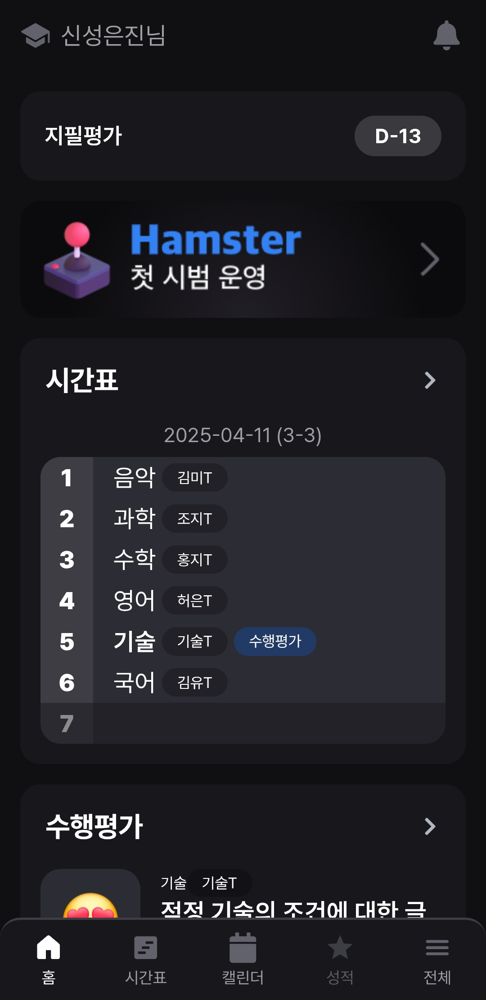
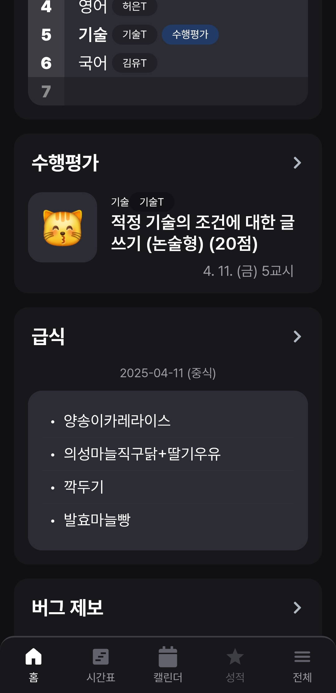
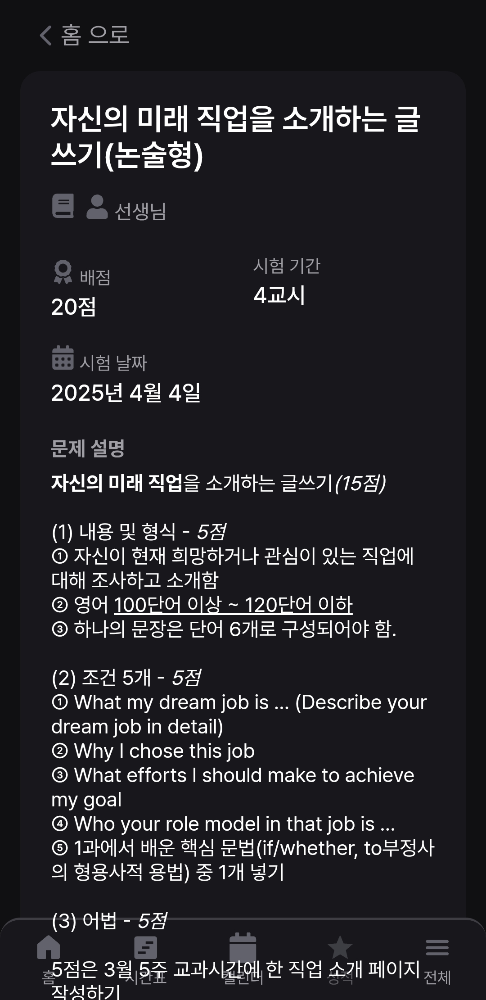
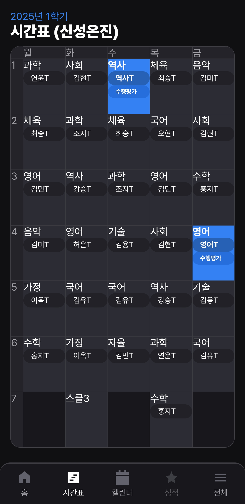
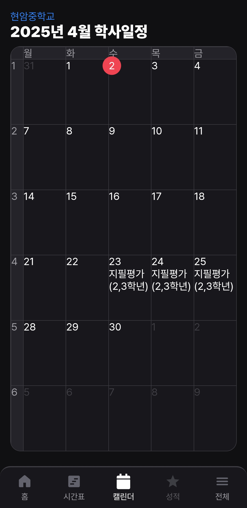

> 현재 이 프로젝트는 사용되지 않으므로, 소스 코드를 오픈합니다.

# 햄스터 (HAMS-TER)

[Client](hamster-client.vercel.app) [Dashboard](hamster-dashboard-khaki.vercel.app) [Server](hamster-server.vercel.app)

햄스터(HAMS-TER)는 현암중학교 학생들의 학사 관리 효율화를 위해 개발된 공식 애플리케이션입니다. 2025년 학생자치회 회장 공약의 일환으로 시작되어 2025년 4월 정식 서비스를 목표로 개발 하였습니다.

## 주요 기능

- **수행평가 일정 관리**: 과목별 수행평가 일정 및 상세 정보를 조회 할 수 있습니다.
- **학사일정 통합 관리**: 학교 행사 및 주요 일정을 달력에 연동하여 학사일정을 한 눈에 볼수 있도록 만들었습니다.
- **실시간 시간표 확인**: 변동이 심한 시간표를 컴시간 API를 바탕으로 쉽게 조회 가능하도록 만들었습니다.
- **푸시 알림 서비스**: 중요 일정 및 수행평가, 공지사항을 실시간 알림으로 보내드립니다.
- **급식 조회**: 급식은 학교에서 가장 중요한 문제중 하나입니다. 더 효율적인 급식 조회가 가능하도록 만들었습니다.

## 사용 화면

  
  
  
  
  

## 기술 스택

| 분야       | 기술 요소                                                     |
| ---------- | ------------------------------------------------------------- |
| 프론트엔드 | React v19, PWA, React Router v6, Vite                         |
| 백엔드     | Node.js, Express.js, Neon Serverless Postgres, JWT Token 인증 |
| 인프라     | Vercel, Workbox, Web Push API, Git, Yarn, Typescript          |

## 보안 정책

- AES-256 암호화 적용
- 역할 기반 접근 제어(RBAC)
- HTTPS 전송 강제 적용

**라이선스**: MIT  
**문의**: 신성은진 (holy_unjinx@naver.com)
